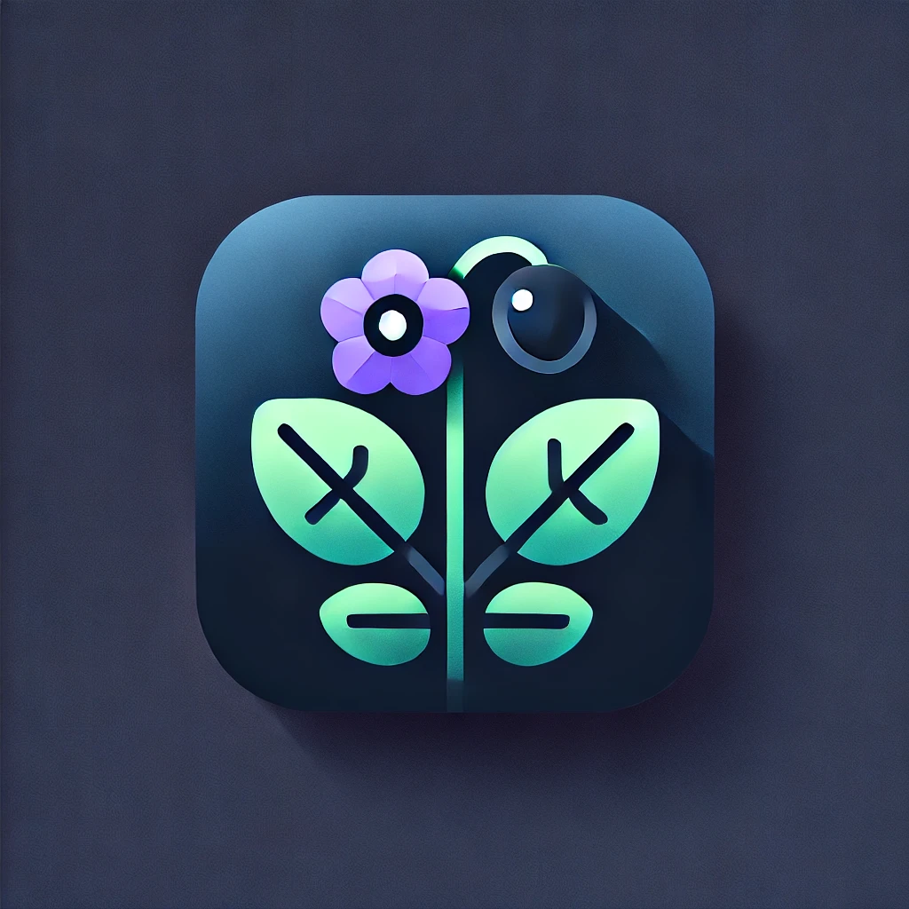
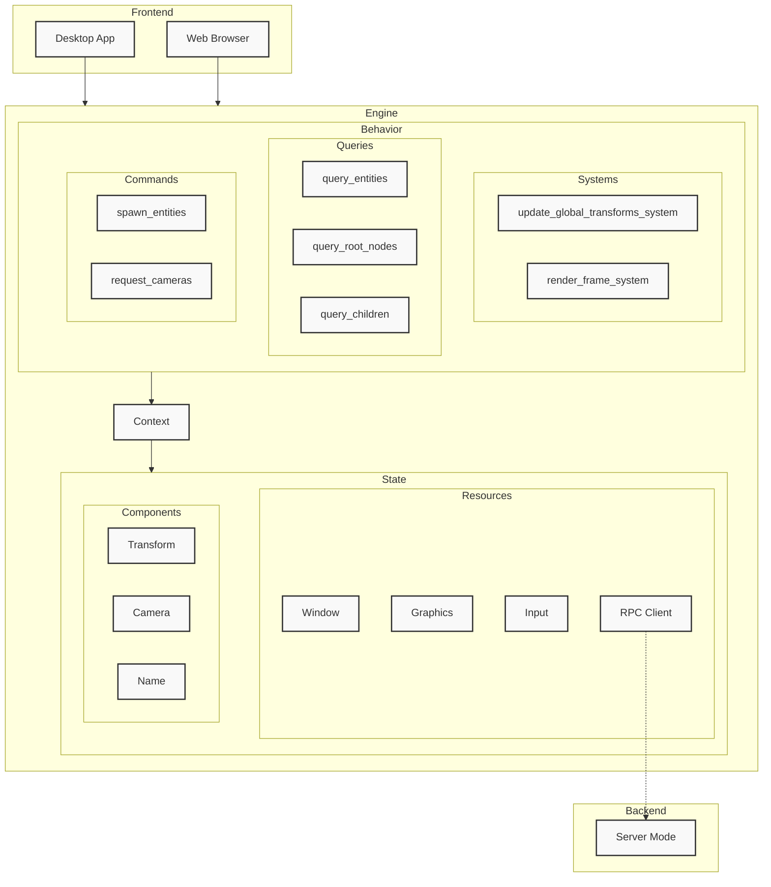

# Nightshade 

`Nightshade` is a portable graphics engine, written in rust


## Quickstart

### Desktop

```bash
cargo run -r
```

### Web

If you have [trunk](https://trunkrs.dev/) installed,
you can serve the app in a web browser:

```bash
rustup target add wasm32-unknown-unknown
cargo install --locked trunk
trunk serve --features web --open
```

> Firefox [does not have sufficient wgpu support](https://news.ycombinator.com/item?id=41157383) and is considered incompatible.

### Justfile

If you have [just](https://github.com/casey/just) installed:

```bash
just run

just init-wasm
just run-web
```

> Run `just` with no arguments to list all commands

## Compact Release

A profile named `release-compact` in the `Cargo.toml` optimizes the build
for space, minimizing the final binary size.

If you have [upx](https://upx.github.io) installed, this can be done with:

```bash
# requires that `upx` is installed
just build-compact
```

The final executable is at `target/release-compact/nightshade` on unix and `target/release-compact/nightshade.exe` on windows.

> The binary size should be significantly smaller than the normal release build executable

## Python Bindings

If you have [maturin]() installed:

```bash
just build-python
```

Then you can install the generated python wheel with:

```bash
pip install python_api/target/wheels/nightshade-*.whl --force-reinstall
```

## Note for Windows Users

If `trunk` fails to install because of `openssl`,
you can use [vcpkg](https://vcpkg.io/en/) to install it.

In `Powershell`, install `vcpkg`:

```bash
# Install vcpkg (optional if you use scoop or chocolatey instead)
iex (iwr -useb https://aka.ms/vcpkg-init.ps1)
```

Then install `openssl` with:

```bash
vcpkg integrate install
vcpkg.exe install openssl:x64-windows-static-md
```

## Note for Mac Users

On Macbooks, the web application's UI scaling will be incorrect
if not running at the laptop screen's native resolution.

To run the app in the web browser properly,
set your laptop's resolution to it's highest possible option.

On a `Macbook M2 Air`:

`Option + F2` -> `Show All Resolutions` -> `2880 x 1864` (highest resolution)

## Architecture


