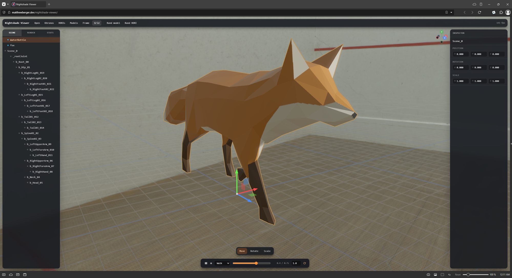

# nightshade-viewer

A glTF/GLB viewer. The whole [Nightshade](https://github.com/matthewjberger/nightshade) engine runs inside a web worker against an OffscreenCanvas, and a full [Leptos](https://leptos.dev) UI drives it from the main thread. The worker renders through WebGPU off the main thread. The page owns the scene tree, the inspector, the asset browsers, drag and drop, and picking.

Live demo: https://matthewberger.dev/nightshade-viewer/



## Workspace

- protocol, the message and data types both sides share, plus the postMessage envelope keys.
- worker, the wasm module inside the web worker. A ViewerWorld (its own freecs world) with systems for camera, loading, picking, scene enumeration, selection, and the asset browsers.
- the root crate, the Leptos UI. Viewport, SceneTree, Inspector, Toolbar, and AssetBrowser components over grouped signal state and a two-directional bridge.
- desktop, the native shell: a webview window over the web bundle, plus, behind the optional `agent` feature, the MCP endpoint and relay that expose the viewer to an external agent (see below).

## Quickstart

Tooling is pinned in [mise.toml](mise.toml). Install [mise](https://mise.jdx.dev) and [just](https://github.com/casey/just), then:

```bash
just init
just run
```

`just run` builds the worker, generates the stylesheet, and opens the viewer in a native webview window. `just run-web` serves the same bundle at http://127.0.0.1:8080 instead; it needs a browser with WebGPU and OffscreenCanvas-in-workers support (Chromium 113+, Firefox 141+). The worker compiles the whole engine, so the first build is large and the worker wasm is several megabytes even after wasm-opt.

## Agent (MCP)

An external MCP agent (such as Claude Code) can drive the viewer with the same access a user has plus structured queries. This is behind a non-default `agent` cargo feature, so `just run` and `just dist` never include it and a deployed build never opens a localhost socket.

Two steps:

1. Run the viewer with the agent feature on (builds the worker, the page, and the desktop shell with `--features agent` and opens the viewer window):

   ```bash
   just run-agent
   ```

   The MCP endpoint and the page relay run inside the viewer process; there is no separate bridge to build or spawn.

2. Register the endpoint with Claude Code:

   ```bash
   claude mcp add --transport http nightshade-viewer http://127.0.0.1:8788/mcp
   ```

   You run this **once**. After that Claude Code can drive the viewer whenever the agent-enabled build is running; for a Claude Code session started before the viewer, reconnect with `/mcp`. To stop it, `claude mcp remove nightshade-viewer`.

The worker, the page, and the desktop shell must share the same `agent` setting; the `run-agent` recipe handles that. See [docs/agent-mcp.md](docs/agent-mcp.md) for the architecture, the full MCP tool surface, and how to drive it.

## License

Dual-licensed under MIT or Apache-2.0, at your option.
